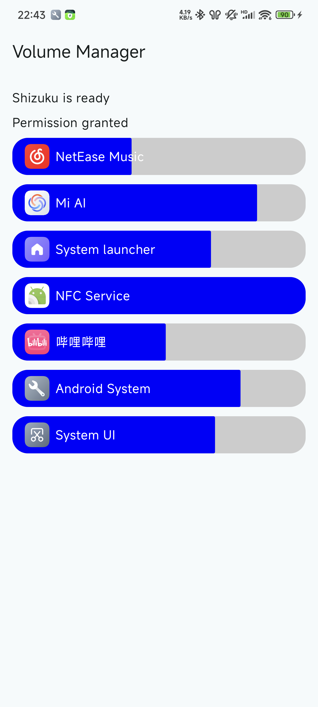

# Volume Manager

**Work in progress**

Control each app's volume independently. [Shizuku](https://shizuku.rikka.app/) is used to access privileged APIs.

## Compare with [SoundMaster from ShizuTools](https://github.com/legendsayantan/ShizuTools/wiki/SoundMaster)

This app uses hidden API to directly change each audio stream's volume.

SoundMaster uses MediaProjection API to record audio from each app and apply post-effects.

|                                | Volume Master  | SoundMaster    |
| ------------------------------ | -------------- | -------------- |
| Control volume of each app     | ✅              | ✅              |
| Set output device for each app | ❌              | ✅              |
| Change left-right balance      | ❌ 1 | ✅              |
| Equalizer (EQ)                 | ❌              | ✅              |
| Control protected apps         | ✅              | ❌ 2 |
| Zero latency added             | ✅              | ❌              |

1: There is API to do it, but not implemented in this app
2: Unless to manually patch each app

## How does it work

Android has multiple APIs to play audio, like [`AudioTrack`](https://developer.android.com/reference/android/media/AudioTrack) and [`MediaPlayer`](https://developer.android.com/media/platform/mediaplayer). They all (hiddenly) extends the [`PlayerBase` class](https://cs.android.com/android/platform/superproject/main/+/main:frameworks/base/media/java/android/media/PlayerBase.java;l=50;drc=7b7d2af960ab6e6acccc2e5e6546545cd38e9a1d), which registers itself to system as [`IPlayer` AIDL interface](https://cs.android.com/android/platform/superproject/main/+/main:frameworks/av/media/libaudioclient/aidl/android/media/IPlayer.aidl;l=1;drc=75e48fea431b1de2bf1715eb5c22ba4c794200bd).

This app uses [`AudioManager#getActivePlaybackConfigurations()` method](https://developer.android.com/reference/android/media/AudioManager#getActivePlaybackConfigurations()) and [`AudioManager#registerAudioPlaybackCallback()` method](https://developer.android.com/reference/android/media/AudioManager?hl=en#registerAudioPlaybackCallback(android.media.AudioManager.AudioPlaybackCallback,%20android.os.Handler)) to get the list of [`AudioPlaybackConfiguration`](https://cs.android.com/android/platform/superproject/main/+/main:frameworks/base/media/java/android/media/AudioPlaybackConfiguration.java;drc=e282cc572ef848b1cb8d622c2c4939aac37c3b27)s, which contains the `IPlayer` remote object, and information about its creator like the process ID.

It then calls [`ActivityManager#getRunningAppProcesses()` method](https://developer.android.com/reference/android/app/ActivityManager#getRunningAppProcesses()) and [`PackageManager#getApplicationInfo()` method](https://developer.android.com/reference/android/content/pm/PackageManager#getApplicationInfo(java.lang.String,%20android.content.pm.PackageManager.ApplicationInfoFlags)) to map the process IDs to apps. Each app can have multiple `AudioPlaybackConfiguration`s.

When user changes an app's volume, it selects all `AudioPlaybackConfiguration`s belong to the app, and calls [`IPlayer.setVolume()` method](https://cs.android.com/android/platform/superproject/main/+/main:frameworks/av/media/libaudioclient/aidl/android/media/IPlayer.aidl;l=29;drc=75e48fea431b1de2bf1715eb5c22ba4c794200bd) to update an internal volume multiplier for each of them. When new `AudioPlaybackConfiguration`s are added to an app, the current set volume is also applied to it.

## TODOs

- [ ] Run in background: currently this app needs to be in foreground to apply volume to new apps and/or streams.
- [ ] Integrate with volume overlay (volume button)

## Note

This app uses the same API as MIUI's "Adjust media sound in multiple apps". Because this API can only setting volume, not reading, the volume set by one app will not be reflected in the other one.
